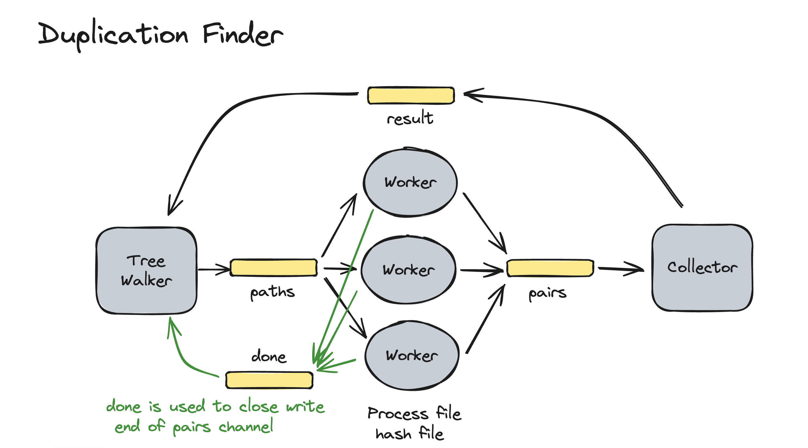

# Duplicate Finder

## Model

Duplicate finder is a concurrent file processor.



## Sequential program
`finder0.go` runs without goroutines and does a sequential file finder.

```shell
$ go run ./finder1 test
864c9c6 2
   test/f1.txt
   test/local/f2.txt
```

## Method 1
`finder1.go` uses a fixed pool of worker goroutines and a sequential file finder to send file paths to the workers.

```shell
$ go run ./finder2 test
864c9c6 2
   test/f1.txt
   test/local/f2.txt
```

## Method 2
`finder2.go` uses a fixed pool of goroutines, but also starts a new file finder goroutine for each directory in the tree.


```shell
$ go run ./finder2 test
864c9c6 2
   test/f1.txt
   test/local/f2.txt
```

## Method 3
`finder3.go` creates a goroutine for each file and directory, but limits the number of goroutines that are allowed to do file system operations (to limit contention).

```shell
$ go run ./finder3 test
864c9c6 2
   test/f1.txt
   test/local/f2.txt
```


